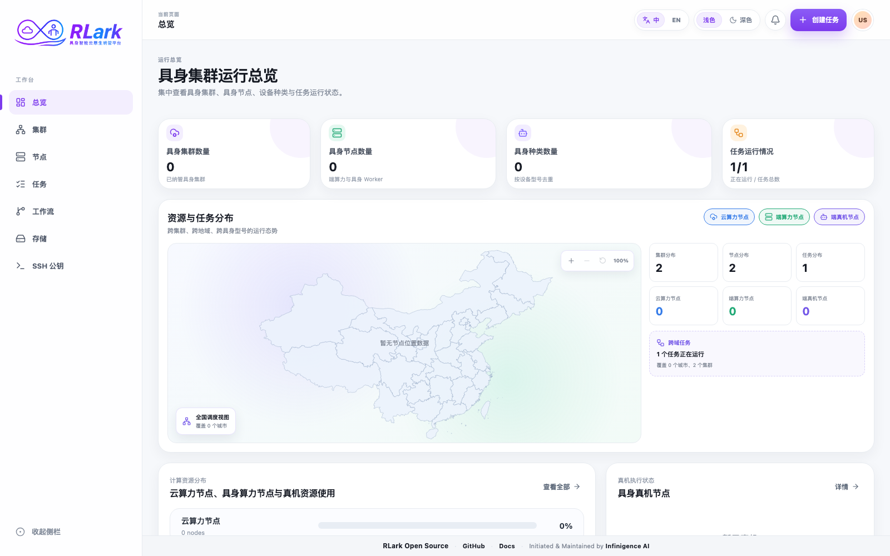

# Console Access and Navigation

## Signing In

RLark has two login entry points:

| Entry            | URL                        | Purpose                                                       |
| ---------------- | -------------------------- | ------------------------------------------------------------- |
| Platform Console | `http://<host>:5173`       | Job management, Workers, storage, SSH keys                    |
| Admin Console    | `http://<host>:5173/admin` | Cluster onboarding, nodes, certificates, system configuration |

### Login Steps

1. Open the console URL in your browser
2. Enter your username and password
3. Click Login
4. The Gateway issues a JWT access token (8 hours by default), and the browser sends it as a Bearer token on subsequent API requests

!!! warning "Role authorization is coarse-grained"
    Gateway enforces `admin` access for control-plane configuration and credential management. The `user` role can manage platform workloads, but per-user resource ownership is not yet implemented, so authenticated users are not isolated from each other's Jobs or storage objects. Continue to use TLS and network controls.

## Console Navigation

### Platform Console Pages

| Page     | Purpose                                                        |
| -------- | -------------------------------------------------------------- |
| Overview | Dashboard summary of clusters, nodes, robots, and running jobs |
| Clusters | Browse and inspect onboarded data-plane clusters               |
| Nodes    | Filter and inspect node resources, scheduling, and health      |
| Jobs     | Create, monitor, and manage training jobs                      |
| Storage  | Browse storage classes and object storage                      |
| SSH Keys | Manage public SSH keys for Worker access                       |

### Admin Console Pages

The **Image Registries** page stores private-registry credentials and selects their distribution scope: store only, selected clusters, or all current and future clusters. Display names may be duplicated and edited; RLark uses an internal ID to identify each credential. Distribution and deletion are asynchronous. Delivered credentials are placed in `rlark-system` on each selected Kubernetes data plane.

> **Screenshot note:** Screenshots are from an example environment. Resource names and data are illustrative; your environment will differ.

### Finding the Right Page

| Question                                       | Go to                              |
| ---------------------------------------------- | ---------------------------------- |
| Is a cluster or node available for scheduling? | Clusters or Nodes page             |
| How to create a training job?                  | Jobs → Create Job                  |
| Which stage is a job stuck at?                 | Job Details → Workers tab          |
| How to find application errors?                | Job Details → Logs tab             |
| How to check resource usage?                   | Nodes page → Node detail           |
| How to open a terminal in a container?         | Job Details → Worker → WebTerminal |
| How to configure private image credentials?    | Admin Console → Image Registries   |

### Refreshing Console Data

Use **Refresh** to request the latest data without leaving the current page. While the request is in progress, the affected table or dashboard is dimmed, its controls are temporarily disabled, and a centered progress indicator is shown. Existing rows remain visible until the refreshed response arrives. This behavior is used consistently across overview dashboards, clusters and nodes, domains, jobs and Workers, storage and files, SSH keys, image registries, and system configuration.

## API Equivalent

Supported resource operations are available through the [Gateway API](../api/reference.md). The standalone Gateway defaults to `http://<host>:8080`; an `rlarkadm` deployment uses its configured Service and UI proxy. The API reference is authoritative because not every UI interaction has a one-to-one public endpoint.
