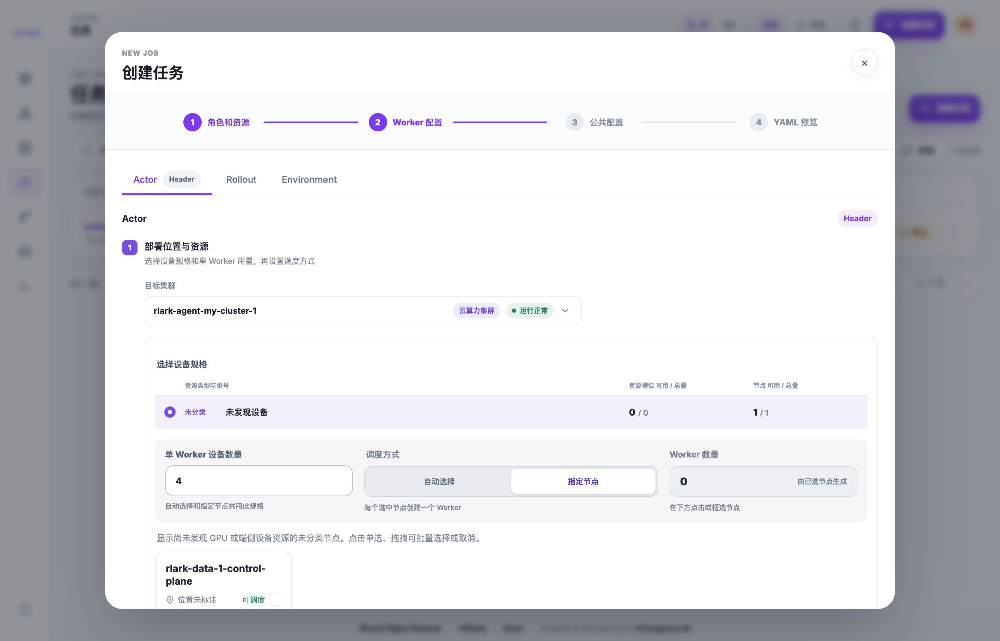
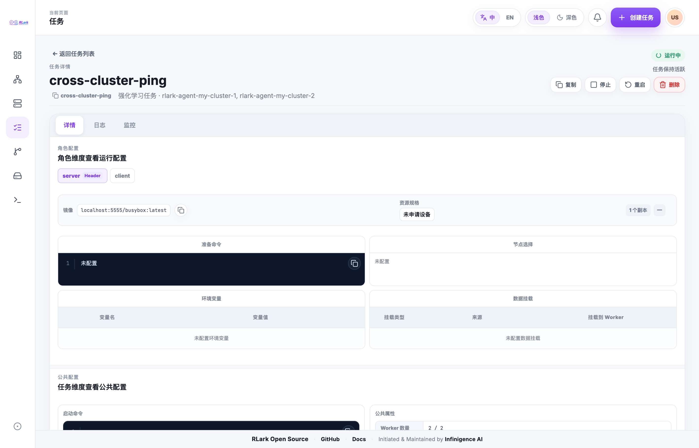
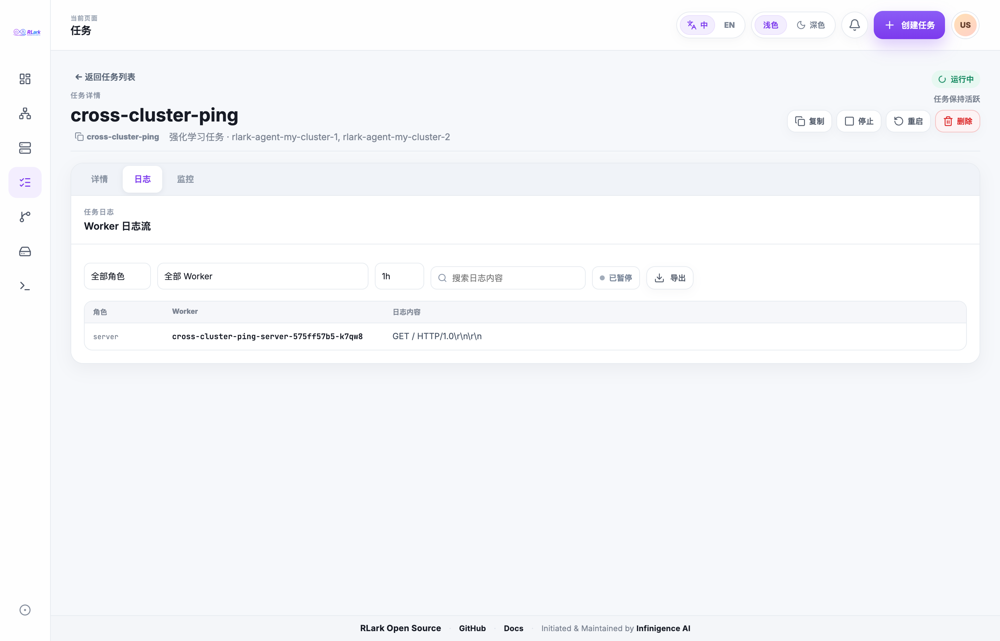

# Jobs

A Job is the user-facing workload. Choose a template or define Task roles, images, commands, replicas, resource requests, storage, and scheduling requirements. After submission, use the Job detail page to follow state changes and inspect its Workers.

Before submitting, confirm that a compatible cluster and node resource are available. See [Core Concepts](../concepts.md) for the Job–Task–Worker relationship.

## Using the UI

Platform Console → Jobs → Create Job. Enter a display name and define the Worker roles. Job display names and role names are limited to 50 characters. Role names must be unique ignoring case; RLark normalizes them into Kubernetes-safe Task resource names. Job display names may be reused because RLark assigns each Job a separate generated resource ID.

For each role:

1. Select the target cluster. Each option shows the cluster name, type label, and current status in one line.
2. Choose one GPU or embodied-device specification from the list, which shows available/total devices and nodes, then set the shared per-Worker resource request. Set the request to `0` for debugging workloads that should keep the placement constraint without requesting the selected device.
3. Choose one scheduling mode:
   - **Automatic selection**: enter the desired Worker count. The console validates the total request against schedulable capacity and selects eligible nodes.

- **Select nodes**: click eligible nodes or drag across node cards. Each selected node creates one Worker; click or drag across selected nodes again to remove them.

When cloning a Job, the scheduling mode is preserved. A role that did not pin
specific nodes remains in automatic-selection mode instead of being converted
to manual node selection. 4. Review the shared placement summary, then configure the image, prepare script, environment variables, and storage mounts.

Submit the Job, then open Job details to verify the running state and inspect Workers.

After selecting a role, its resource summary shows the GPU or embodied-device model configured on the assigned node and its requested quantity, such as `NVIDIA RTX 4090 · 1 GPU`. If the Worker has not reported its assigned node yet, the console resolves the model from the role's selected hostname candidates.

When a Worker is Pending, hover or focus the information icon beside that Worker's status. RLark reads the related data-plane Pod, Task, or node events and converts recognized Kubernetes events into concise pending reasons in the current UI language. The mapping covers common scheduling, node pressure and availability, image-pull, volume, runtime environment, container-creation, and health-check issues. Unrecognized events use a generic pending label instead of exposing raw runtime messages. Image-pull progress remains separate and shows byte or percentage progress only when the runtime reports it.

## Job Types

RLark supports the following job types, each pre-configured with default roles tailored to the workload:

- **Reinforcement Learning** — Designed for distributed RL training workflows. Default roles include Actor, Rollout, Environment, and Learner.
- **Data Collection** — Optimized for collecting training data from embodied agents or sensors. Default roles include Collector and Storage.
- **Evaluation** — Runs evaluation and benchmarking against trained models. Default roles include Evaluator and Monitor.
- **Custom Job** — Full flexibility to define your own roles and topology. No default roles are pre-configured.

Each job type pre-configures a set of default roles. You can add, remove, or customize roles to fit your specific training pipeline. Roles define the worker groups that collaborate during training, and each role can have its own container image, resource requirements, and command.

## Worker Configuration

For each worker role, configure the following:

- **Cluster and Node** — Select the target cluster and optionally a specific node. Use the **Node Selector** to filter nodes by attributes such as:
  - Node type: cloud, edge, or robot
  - GPU model (e.g., A100, H100, RTX 4090)
  - Physical location or zone

- **Container Image** — Specify the container image for this role. You can select one of the 10 most recently used images, with its last-used time and Job usage count, or enter an image tag (for example, `myimage:latest`) or digest (`myimage@sha256:...`). Using a digest is recommended for reproducibility and auditability. For private images, configure credentials under **Admin Console → Image Registries** and distribute them to the target cluster. RLark matches both normal and init-container images by registry prefix and appends every matching delivered Secret to `imagePullSecrets`; duplicate credentials for the same registry are supported. Credentials currently target workloads in `rlark-system` only, and a Task does not wait for asynchronous delivery to finish.

- **Resource Requests** — Set the CPU, memory, and GPU resources required per worker:
  - CPU: specified in cores (e.g., `4`)
  - Memory: specified in GiB (e.g., `16Gi`)
  - GPU: number of GPUs (e.g., `1`, `2`, `8`)

- **Init Scripts** — Commands that run before the main entrypoint. Useful for environment setup, dependency installation, or data preparation.

- **Storage Mounts** — Attach storage to worker containers. Two types are supported:
  - **hostPath**: Mount a directory from the host node's filesystem. Its data is not deleted by Job lifecycle actions.
  - **PVC** (PersistentVolumeClaim): Mount a Kubernetes persistent volume using the selected storage class. Stopping, restarting, or deleting the Job deletes its task PVCs; starting or restarting creates empty PVCs.

> **Screenshot note:** Screenshots are from an example environment. Resource names and data are illustrative; your environment will differ.



## Shared Configuration

Configure settings that apply to all workers in the job:

- **Header Role** — Select one role as the Header role. For Ray workloads, configure this role with exactly one Worker; it coordinates distributed training and its IP address is communicated to all other Workers.

- **Cross-Cluster Network Domain** — If network domains are configured, the console automatically enables the first domain by name for every Job, regardless of Worker placement. No domain is added when none is configured.

- **SSH Public Keys** — Provide one or more SSH public keys that will be injected into the `~/.ssh/authorized_keys` of every worker container. This allows you to SSH into running containers for debugging.

- **Run Command** — The main training script or entrypoint command. This is executed after any init scripts complete.

- **TensorBoard** — Enable TensorBoard monitoring for the job. Configure the log directory path and the port on which TensorBoard will be served.

## Inspecting Workers and Pods

### Job Overview

Open the Job Details page from the Jobs list to see a high-level summary:

- **Name** — The user-facing display name. It may be reused; RLark assigns a separate `jo-<16 hexadecimal characters>` resource ID.
- **Type** — The job type (Reinforcement Learning, Data Collection, Evaluation, Custom)
- **Status** — Current state: Pending, Running, Stopping, Stopped, Succeeded, or Failed. `Stopping` is the transitional state while RLark waits for the Job and all child Tasks and Workers to stop.
- **Worker Count** — Total number of workers across all roles
- **Creation Time** — When the job was submitted
- **Header Role** — The role designated as the coordinator

### Worker List

Below the overview, the worker list shows every worker instance with:

- **Instance Name** — Auto-generated name (e.g., `myjob-actor-0`)
- **Role** — The role this worker belongs to
- **Node** — The physical node hosting this worker
- **Cluster** — The data-plane cluster that owns the Worker; the node name is a
  link to that node's detail page
- **IP** — The Pod IP address
- **Status** — Per-worker status (Pending, ContainerCreating, Running, Terminated)

Use **Refresh** in the list header to update Task, Pod, placement, IP, and status information without reloading the page.

On both the Jobs page and the Worker list, **Refresh** updates only the corresponding data region. While the request is in progress, existing rows stay in place under a dimmed loading mask with a centered spinner, and actions in that region are temporarily disabled. The rest of the page remains available.

Click any worker to see its runtime details, including container status, resource usage, and events.

### Per-Role Configuration

Expand a role section to view the configuration that applies to all workers in that role: image, resource requests, init scripts, and storage mounts.



## Viewing and Exporting Logs

The **Logs** tab aggregates the main container logs from all workers in the job.

### Log Features

- **Default selection and refresh** — The first role is selected by default. Logs refresh only when you click **Refresh**.
- **Aggregated View** — Logs from the selected role or Worker are combined into a single stream, with each line tagged by Worker and role. Historical Workers remain selectable after their Pods have terminated.
- **Time Range** — Select 15 minutes, 1 hour, 6 hours, 24 hours, 7 days, or a custom interval.
- **Ordering** — Sort log entries in ascending or descending time order.
- **Search** — Search for complete words or phrases; partial-word matching is not performed.
- **Log-backend pagination** — When a log backend is configured, each page contains at most 99 entries and additional pages are retrieved with a cursor.
- **Pod fallback** — Without a log backend, RLark falls back to Pod logs and retrieves up to 1000 lines from each Pod.

### Exporting Logs

Click **Export** to download the current log view as a CSV file. The CSV contains three columns:

- `worker` — The worker instance name
- `role` — The role of the worker
- `message` — The log message content



## WebTerminal Access

You can open an interactive terminal directly into the main container of any running worker. This is useful for debugging and inspection without needing SSH access.

### Opening a Terminal

From the Worker list, click **Terminal** on any running Worker. This opens `/bin/bash` by default in the Worker's main container. The browser establishes a WebSocket to Gateway, which proxies the session through Server to Agent and then execs into the container. The user does not need to log in with SSH.

### Diagnostic Commands

Once inside the terminal, you can run diagnostic commands to inspect the container environment:

```sh
pwd                     # Check the current working directory
id                      # Verify the user identity
ls -la                  # List files in the working directory
df -h                   # Check disk usage and mount points
cat /proc/mounts        # Inspect all mounted filesystems
env                     # View environment variables
nvidia-smi              # Check GPU status (if GPU is allocated)
```

### File Transfer

The key button in the Worker list copies the SSH connection command. It requires an administrator-configured SSH jump host; when that setting is missing, the button is disabled and explains why instead of copying empty content.

The WebTerminal supports file upload and download:

- **Upload** — Upload files from your local machine to the container's default working directory. File names must match the pattern `[A-Za-z0-9._-]+`.
- **Download** — Enter the path of the file inside the container, then download it to your local machine.

All file transfers are performed over the same WebSocket connection used by the terminal, ensuring security and simplicity.

## Managing Jobs

### Lifecycle Actions

The detail-page action bar supports the full Job lifecycle:

- **Stop** sets a running Job to `Stopping`, deletes its child Task CRs, and waits for their Workers and PVCs to be cleaned up. It preserves the Job configuration.
- **Start** starts a `Stopped` Job with the same configuration and newly created empty task PVCs, including Jobs stopped after reaching a terminal result.
- **Restart** opens a choice: restart immediately with the current configuration, or edit the Job and restart after the updated configuration is saved. `Succeeded` and `Failed` Jobs restart as clean runs: RLark stops and cleans up the previous Tasks, Workers, and task PVCs before creating new Tasks, Workers, and empty PVCs. During edit-and-restart, available capacity includes resources that the current Job will release.
- **Delete** opens a danger confirmation that identifies the target Job and warns that the operation cannot be undone before permanently removing it.

Lifecycle actions require confirmation. While an action is in progress, the
other action buttons are disabled; failures are shown in the same action area.
After a successful action, the console returns to the Jobs list and shows a
completion notice.

Deletion is synchronous from the console's perspective: RLark first stops the
Job, waits until all child Tasks and Workers reach a terminal state, deletes the
Job, and then waits until the Job and child Tasks are gone before updating the
list.

Each Jobs table row directly exposes Clone, Restart, and Start/Stop text buttons, while Delete remains in the adjacent more-actions menu. Restart uses the same immediate-restart or edit-and-restart choice as the detail page. Expanded Worker details focus on cluster, role, node, and GPU information without CPU or memory request cards.

### Stop a Running Job

Stopping a Job first changes its displayed state to `Stopping`. RLark deletes all child Task CRs and waits for their Worker Pods and task PVCs to be cleaned up. Job configuration, logs, metadata, and hostPath data are preserved.

The time at which a manually stopped Job enters `Stopped` is recorded and shown in the Jobs table.

### Resume a Stopped Job

Starting a stopped Job recreates the Tasks, Worker Pods, and empty task PVCs from the same configuration. Previous PVC data is not restored; hostPath data remains available. Restarting a succeeded or failed Job performs the same clean stop-and-recreate sequence rather than reusing terminal Tasks or PVC data.

### Delete a Job

Deleting a job performs a full cleanup:

- Worker Pods are terminated
- PVCs are deleted (but hostPath data is preserved on the node)
- Job metadata and logs may be retained for a configurable retention period

> **Note:** Data stored on hostPath mounts is not deleted when the job is removed. You must manually clean up hostPath directories if needed.

### Edit or Clone a Job

- **Edit** — Modify a stopped job's configuration (roles, resources, commands) and resubmit.
- **Clone** — Create a copy of an existing job configuration to use as a template for a new job.

## Preflight Checklist

Before submitting a job, verify the following:

| Item                  | Description                                                                                                                              |
| --------------------- | ---------------------------------------------------------------------------------------------------------------------------------------- |
| Cluster Resources     | The target cluster has sufficient CPU, memory, and GPU capacity for all workers                                                          |
| Node Compatibility    | Nodes matching your selector (type, GPU model, location) are available and schedulable                                                   |
| GPU / Embodied Device | If requesting GPUs or embodied devices (robot, camera), confirm the required models are present on the selected nodes                    |
| Container Image       | The specified image is accessible from the target cluster. If using a private registry, ensure image pull secrets are configured         |
| Storage Paths         | hostPath directories exist on the target nodes and have correct read/write permissions. PVC storage classes are available in the cluster |
| Cross-Cluster Network | If the job spans multiple clusters, the network domain is configured and DomainPeer relationships are established                        |
| SSH Keys              | SSH public keys are valid and correctly formatted                                                                                        |

## API Equivalent

All job management operations can be performed programmatically via the REST API:

```
POST /api/v1/rlinf.io/v1alpha1/jobs
```

This endpoint accepts a `Job` CRD object in the request body. For complete request examples and status query patterns, see [API Examples](../api/examples.md).
