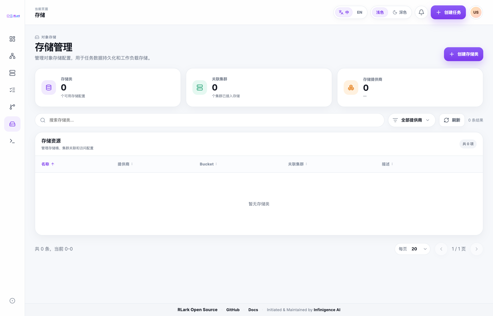

# Storage

## Storage Types

RLark supports two storage types for training jobs:

| Type | Use Case | Lifecycle |
|------|----------|-----------|
| Host Directory | Data already on the node, high I/O | Job lifecycle actions do not delete data |
| Object Storage (ephemeral PVC) | Remote storage within one Pod run | Kubernetes creates and removes the PVC with its Pod |

## Host Directory

- Administrator must confirm the path exists on the target node with correct permissions
- Specify source path (node filesystem) and mount path (container filesystem)
- Data persists on the node after job deletion

## Object Storage

- Uses a Kubernetes generic ephemeral volume and StorageClass
- Each PVC mount defaults to a 10Gi request; the configurable size range is 1–200Gi
- Select cluster first, then available StorageClasses appear in the dropdown
- Each worker Pod receives its own PVC

## Managing Storage Classes

Open **Storage** to review object-storage configurations, associated clusters, providers, and buckets. Create the required storage class before configuring a PVC mount for a Worker.

> **Screenshot note:** Screenshots are from an example environment. Resource names and data are illustrative; your environment will differ.

## Using Storage in a Training Job

When creating a job, in the Worker configuration step:
1. Select the storage type (hostPath or PVC)
2. Enter the source path (for hostPath) or select StorageClass (for PVC)
3. Enter the container mount path
4. Your training code reads/writes to the mount path

## Checking Read/Write

Verify the storage chain:
1. Source location is accessible
2. Container mount is correct
3. Application can read input data
4. Application can write output data
5. Copy required PVC output elsewhere before stopping or restarting the Job

## Lifecycle

- Stop or restart: deleting worker Pods also deletes their ephemeral PVCs; hostPath data is preserved
- Start or restart: Kubernetes creates new ephemeral PVCs for the new Pods
- Delete: deleting worker Pods also deletes their ephemeral PVCs; hostPath data is preserved

## API Equivalent

Use StorageClass, provider, and object-file endpoints described in the [Storage API](../storage-api.md).
